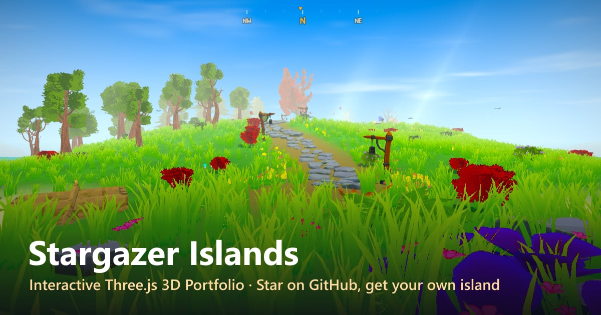

# 🌙 Stargazer Islands — Interactive Three.js 3D Portfolio

<p align="center">
  <a href="https://threejs.ryhox.dev/"><strong>🌍 Play it live → threejs.ryhox.dev</strong></a>
  &nbsp;·&nbsp;
  <a href="https://threejs.ryhox.dev/about/">About the project</a>
</p>

<p align="center">
  <a href="https://threejs.ryhox.dev/">
    
  </a>
</p>

**Stargazer Islands** is an open-source **Three.js portfolio** — a cozy, explorable **3D website** built with **React Three Fiber**, TypeScript and custom GLSL shaders. Walk the island, swim, sit by the campfire, sail the boat through a day/night cycle, and — the twist — **every GitHub stargazer of this repo gets their own procedurally generated island** in the world. ⭐ Star it and yours appears within minutes.

<div align="center">
  
  
</div>

---

<h3 align="center">
made with</h3>
<p align="center">
  
  
  
  
</p>

---

<h5 align="center">
Grab a warm cup of herbal tea, rest your feet by the virtual campfire, and enjoy your stay in the woods. ☕🕯️🍂
</h5>

---

## ⭐ Get your own island

My home isle sits in the middle of a sea — **The Archipelago** — and **every person who stars this repo gets their own permanent island out there.** ⭐ → 🏝️

The world map opens as soon as the page loads: pick my home isle in the middle, or any stargazer's island. Once you're in, board the boat (**E**) and sail over — it's all one world — or press **M** anytime to search a GitHub username and hop straight there. Star the repo and your island appears on everyone's map within ~5 minutes (the map shows a shared countdown to the next refresh).

### How your island is made

It's all decided the moment you star — no account, no server, nothing to set up. Three things make your island, and they're **locked to you forever:**

- **📍 Where it is** — your island's spot comes from your **star order** (the rank at which you starred). Your rank never changes, so your island never moves.
- **🎨 What it looks like** — its **region** and **look** come from your **GitHub username**.
- **📐 How big it is** — its **size** (*Small* up to a rare *Huge*) also comes from your username, but it's drawn **independently of the look** — so any look can turn up in any size. That's why a *Huge Sakura Grove* is such a jackpot: it's two lucky draws landing at once.

> **🔢 What does "from your username" mean?** Your username is run through a **hash** — a little formula that scrambles text into a number. The same username *always* produces the same number, and there's no way to steer it. The game feeds that one number into the rolls above, so your island is decided entirely by *who you are* — identical for every visitor, on every device, with nothing stored anywhere. Change a single letter of your name and you'd get a completely different island.

### The odds 🎲

When you arrive on an island, press **I** for an info card showing exactly how lucky that roll was. Here's the full breakdown:

**Region** — which cluster your island lands in (rarer regions are the prettier ones):

| Region | Rarity | Chance to land here |
| --- | --- | --- |
| 🌳 Wildwood Reach | Common | ~30% |
| 🪨 Bleakshoal Keys | Common | ~27% |
| 🍂 Ember Hollow | Uncommon | ~14% |
| 🏜️ Sunscorch Reach | Uncommon | ~13% |
| ❄️ Frostfell Isles | Uncommon | ~11% |
| 🌸 Bloomtide Vale | Rare | ~5% |

**Look** — once you're in a region, which variant you get:

| Region | Looks (chance within the region) |
| --- | --- |
| Wildwood Reach | Oakwood 65% · Pinehaven 35% |
| Bleakshoal Keys | Stoneshoal 55% · Greywaste 45% |
| Ember Hollow | Emberwood 60% · Hollowwood 40% |
| Frostfell Isles | Snowdrift 55% · Frostpine 45% |
| Sunscorch Reach | Sunscorch Dunes 60% · Redrock Mesa 40% |
| Bloomtide Vale | Sakura Grove 100% |

**Size** — rolled independently of the look:

| Size | Chance |
| --- | --- |
| Small | ~50% |
| Medium | ~32% |
| Large | ~14% |
| Huge | ~4% |

Your island's **overall rarity** is the chance of its exact look (region × variant) multiplied by the chance of its size — so a *Huge Sakura Grove* is a true jackpot. The info card (**I**) shows each percentage and the combined "1 in N" odds for your island. 🍀


---

## ✨ Features

- 🏝️ **Explorable 3D island** — third-person walking, a hilltop shrine, forests, flowers and a campfire
- ⛵ **Sailable boat** — one continuous ocean world between every island
- 🐟 **Swimming & underwater** — fish, manta rays and a sea floor
- 🌅 **Day / night cycle** — custom sky-dome shader, light shafts and a starry night
- 🌊 **Custom GLSL water** — waves plus an interactive ripple simulation
- ⭐ **An island for every GitHub stargazer** — generated from your username
- 🗺️ **World map** — press **M** to search any stargazer and travel there
- 📱 **Desktop & mobile**, Low / Medium / High graphics, **10 languages**

## 🛠️ Tech stack

[Three.js](https://threejs.org/) · [React Three Fiber](https://github.com/pmndrs/react-three-fiber) · [drei](https://github.com/pmndrs/drei) · [postprocessing](https://github.com/pmndrs/postprocessing) · GLSL shaders · TypeScript · React · Zustand · GSAP · Vite · GitHub Actions (publishes the stargazer list)

## 🚀 Run it locally

```bash
git clone https://github.com/Ryhox/Stargazer-Islands.git
cd Stargazer-Islands
npm install
npm run dev
```

Looking for a **Three.js project** to learn from or a **3D portfolio template**? The code is MIT-licensed — fork it, read it, build your own world. And don't forget to ⭐ star the repo to claim your island.
